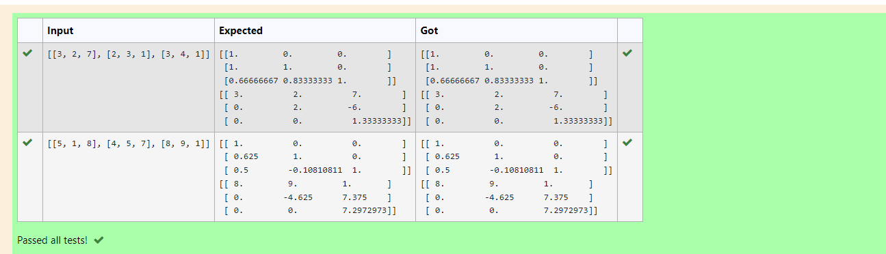
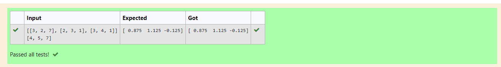

# LU Decomposition without zero on the diagonal

## AIM:
To write a program to find the LU Decomposition of a matrix.

## Equipments Required:
1. Hardware – PCs
2. Anaconda – Python 3.7 Installation / Moodle-Code Runner

## Algorithm
1. Import numpy as np.
2. From scipy package import lu.
3. Get input from user. 
4. Print result.

## Program:
```
/*
Program to find the LU Decomposition of a matrix.
Developed by: B.Pavizhi
RegisterNumber: 21500608
# To print L and U matrix
import numpy as np
import scipy
from scipy.linalg import lu
a=eval(input())
P,L,U=lu(a)
print(L)
print(U)
# To print X matrix (solution to the equations)
import numpy as np
import scipy
from scipy.linalg import lu_factor,lu_solve
A=([[3,2,7],[2,3,1],[3,4,1]])
B=([4,5,7])
lu,piv=lu_factor(A)
x=lu_solve((lu,piv),B)
print(x)

*/
```

## Output:



## Result:
Thus the program to find the LU Decomposition of a matrix is written and verified using python programming.

